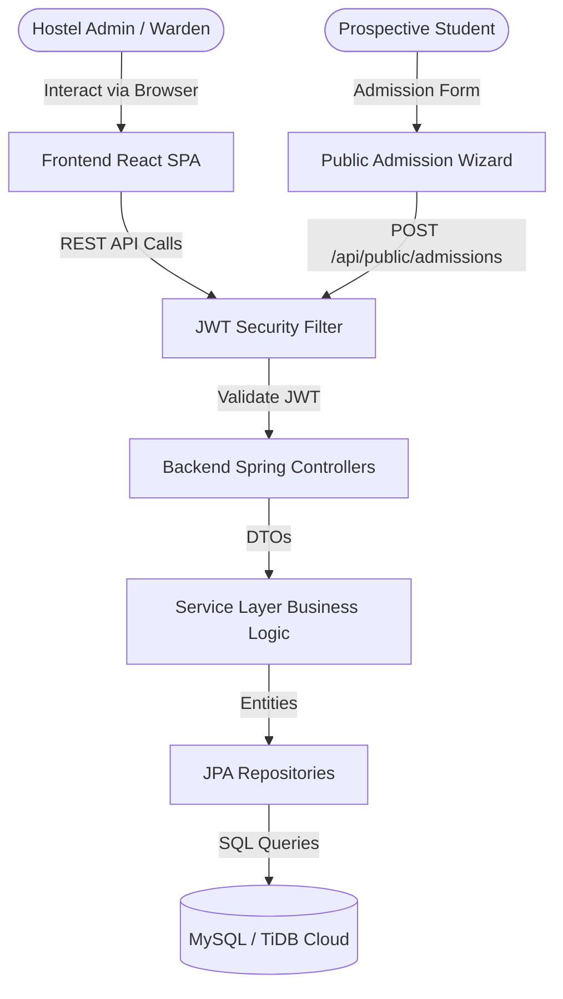
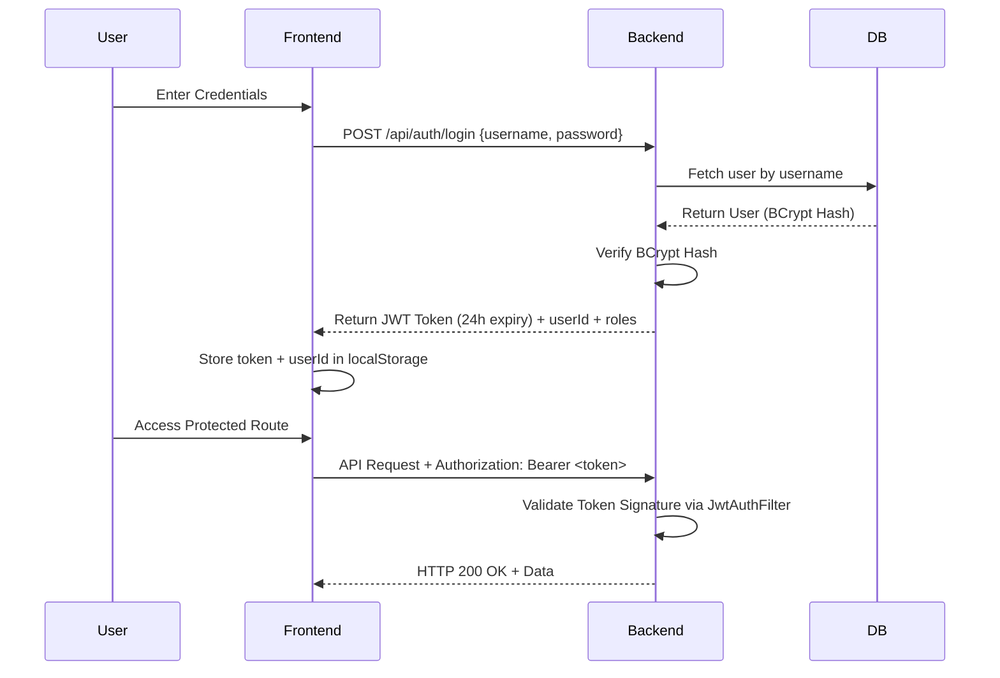
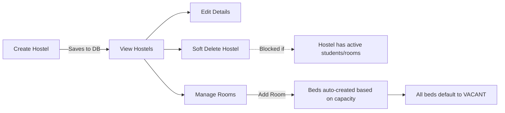
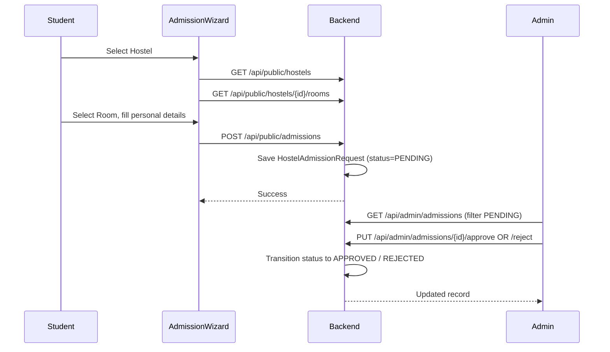
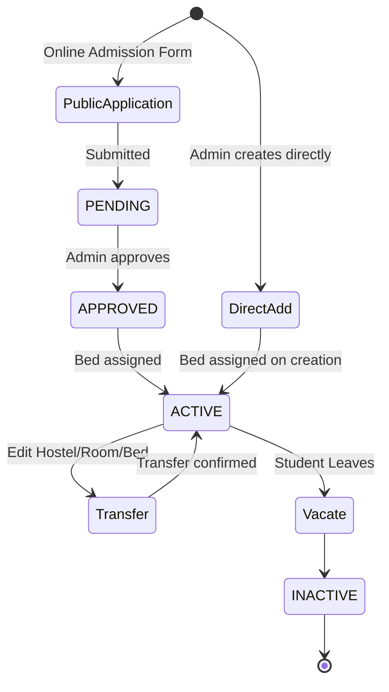
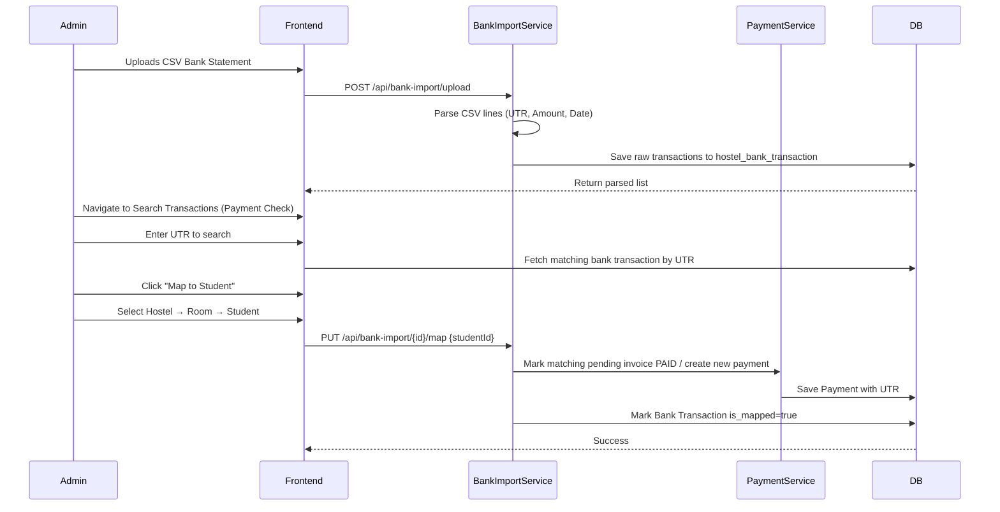
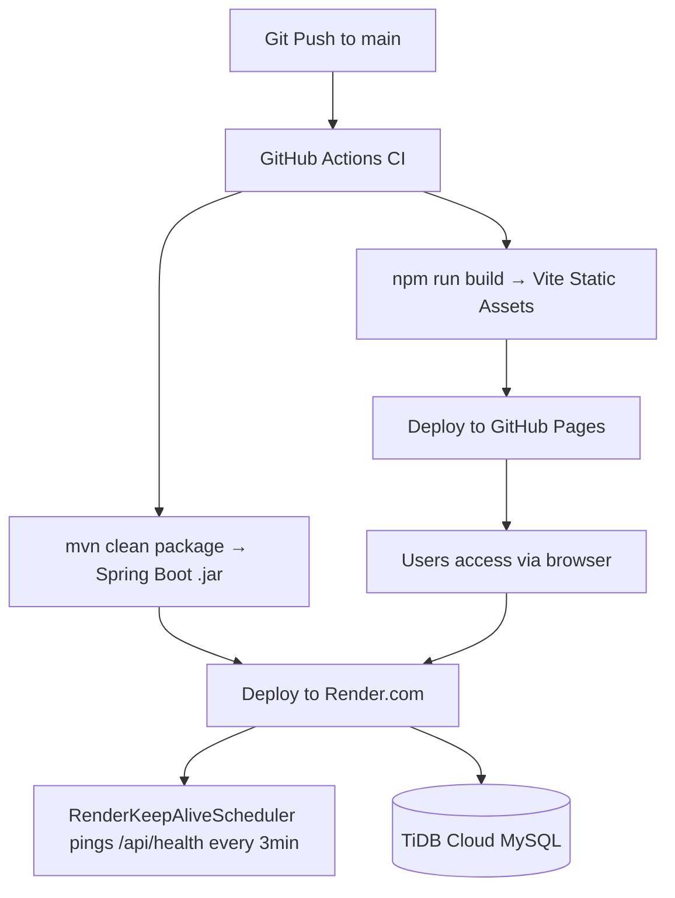

# Application Workflow Documentation

## 1. Overall System Flow

## 2. Authentication Flow

## 3. Dashboard Flow

- **Hostel Context:** A global hostel selector (persisted in `localStorage`) filters all KPIs and data across every screen. Selecting "All Hostels" shows cumulative totals.
- **KPI Calculation Flow:** When the dashboard mounts, the frontend requests `/api/dashboard/stats?hostelId=<id>`. The `DashboardServiceImpl` queries the DB.
  - **Total Beds:** Counts all non-deleted beds for the selected hostel.
  - **Occupied Beds:** Counts beds with `status = 'OCCUPIED'`.
  - **Vacant Beds:** `Total Beds - Occupied Beds`.
  - **Revenue:** Sums `amount` of all payments matching `status = 'PAID'` for the selected hostel.
  - **Dynamic Filters:** If `hostelId` is provided, all JPA queries are scoped to that hostel.

## 4. Hostel Infrastructure Flow

## 5. Room & Bed Flow

1. **Room Creation:** Admin selects a Hostel context and adds a Room (Floor, Type, Capacity).
2. **Bed Auto-Generation:** When a room is created/updated, the system automatically ensures the correct number of beds exist to match `capacity`. Missing beds are created; excess beds are soft-deleted.
3. **Bed Count Sync:** Room total bed count is always derived from actual bed records in `hostel_beds`, not a stored field — ensuring consistency.
4. **Assignment:** When a Student is assigned to a bed during admission, the bed's `status` transitions to `OCCUPIED` and `student_id` is populated.
5. **Room Delete (Cascade):** Soft-deleting a room also soft-deletes all its associated beds.

## 6. Public Admission (Online Application) Flow

- Admission form is a **multi-step wizard** (scrollable, mobile-friendly).
- Status transitions: `PENDING` → `APPROVED` or `REJECTED`.
- Rejection requires a reason via a dedicated modal dialog (no browser `prompt()`).

## 7. Student Lifecycle Flow

## 8. Payment Collection Flow

1. **Generation:** Admin clicks "Generate Invoices". The system creates a `PENDING` payment record for every `ACTIVE` student (one per month/year; skips duplicates).
2. **Manual Entry (Cash):** Admin edits the pending payment → changes status to `PAID` → UTR left blank.
3. **Digital Payment (UPI/Bank):** Admin edits the pending payment → changes status to `PAID` → enters the exact UTR Number.
4. **Need to Pay KPI:** `Total active students - Count of students with PAID status for the selected month`.

## 9. Bank Statement Upload & Verification Flow

## 10. Expenses Flow

- **Global Expenses:** Expenses are **not tied to a specific hostel** — they represent shared operational costs (utilities, maintenance, staff) for the entire organization.
- **Date Filter:** Expenses dashboard defaults to the **current month** on load. Users can change the date range via a date picker.
- **CRUD:** Admin can create, view, and delete expense records. Each record captures: Category, Amount, Date, Description, Receipt URL.
- **Dashboard Impact:** Expense totals feed into profit/loss calculations on the main dashboard.

## 11. Report Generation Flow

1. User navigates to `/reports` and selects a specific tab (e.g., Students).
2. Frontend fetches the complete unpaginated list of active records for the selected hostel.
3. User clicks **Export CSV**.
4. Frontend executes a client-side CSV generation script (converting JSON array to CSV string) and triggers a browser download natively — no server round-trip required.

## 12. Search Transactions (UTR Verification) Flow

1. Admin navigates to Search Transactions.
2. Enters a UTR number in the search field.
3. System queries `hostel_bank_transaction` table for a matching UTR.
4. If **matched and mapped** → shows the linked student details.
5. If **matched and unmapped** → offers to map to a student via cascading dropdowns (Hostel → Room → Student).
6. If **not found** → displays a clear error message.
7. Phone number is required for mapping; if absent, an error is shown.

## 13. Error Handling Flow

1. **Frontend Validation:** Zod schemas prevent invalid form submissions (e.g., negative rent, missing names).
2. **Backend Validation:** Spring Boot `@Valid` checks constraints (`@NotBlank`, `@Min`, etc.).
3. **Business Rule Violation:** If a rule fails (e.g., UTR duplication), the Service throws `IllegalArgumentException`.
4. **Global Handler:** `GlobalExceptionHandler.java` catches exceptions and returns a standardized HTTP 400 JSON: `{"message": "UTR Number already exists", "errorCode": "BAD_REQUEST"}`.
5. **UI Feedback:** Axios interceptor reads the error response and displays a red Toast notification in the bottom-right corner.

## 14. Data Import Flow (Bulk Student Import)

- Bulk import of existing student data is performed via Python scripts (`scripts/import_h1_students.py`, `scripts/import_h2_students.py`).
- **Process:**
  1. Read Excel file (room/bed/student data).
  2. Map Excel room numbers to DB room IDs.
  3. Create missing beds if room capacity differs from DB.
  4. For each occupied bed: insert student with AES-GCM encrypted phone + HMAC hash.
  5. Mark bed as `OCCUPIED`, update room status (`AVAILABLE` / `PARTIAL` / `OCCUPIED`).
- **Encryption:** Matches the Java `EncryptionService` — AES/GCM/NoPadding, 12-byte IV, HmacSHA256 hash.

## 15. Deployment Flow

## 16. Complete End-to-End Business Flow

1. **Onboarding:** Owner Login → Create Hostel (with hostel code) → Create Rooms → Beds auto-created.
2. **Admission (Online):** Student fills public admission wizard → `PENDING` request → Admin approves/rejects.
3. **Admission (Direct):** Admin creates Student Profile → System encrypts PII → Assign to Bed → Bed marked `OCCUPIED`.
4. **Billing:** Click 'Generate Invoices' on 1st of month → `PENDING` payment records created for all active students.
5. **Collection:** Students pay → Admin marks payments as `PAID` (cash: no UTR; UPI: with UTR).
6. **Bank Reconciliation:** Export CSV from bank → Upload via system → UTRs parsed and stored.
7. **Mapping:** Go to Search Transactions → Enter UTR → Map to student → Payment auto-marked `PAID`.
8. **Reporting:** Dashboard updates with collected revenue → Export reports as CSV.
9. **Expenses:** Log monthly operating expenses → Visible on Expenses Dashboard.
