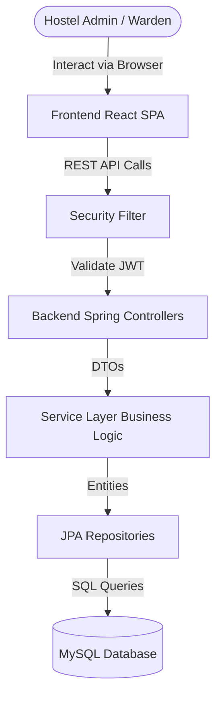
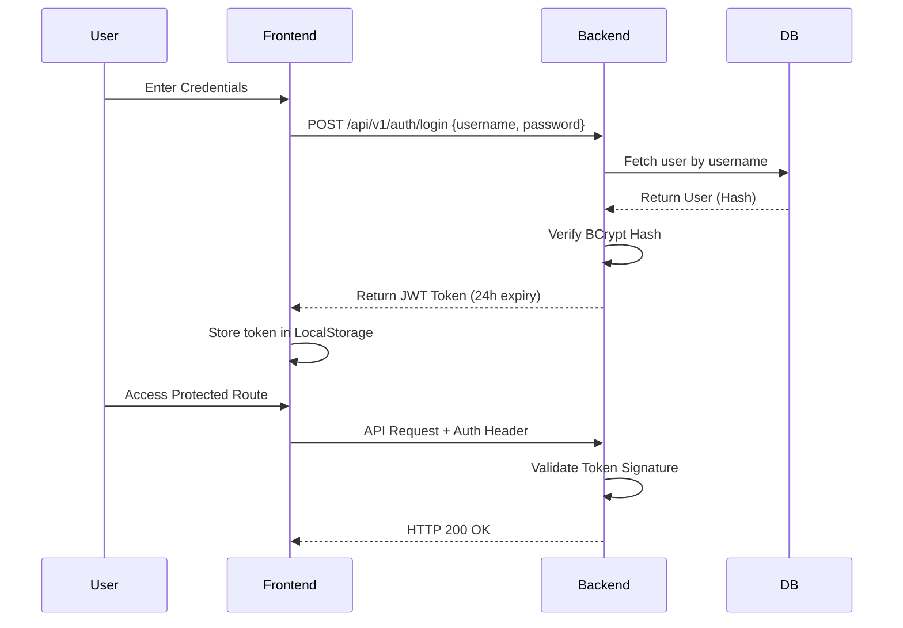
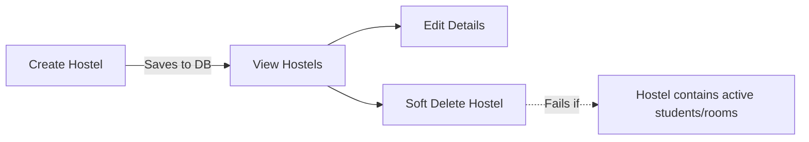
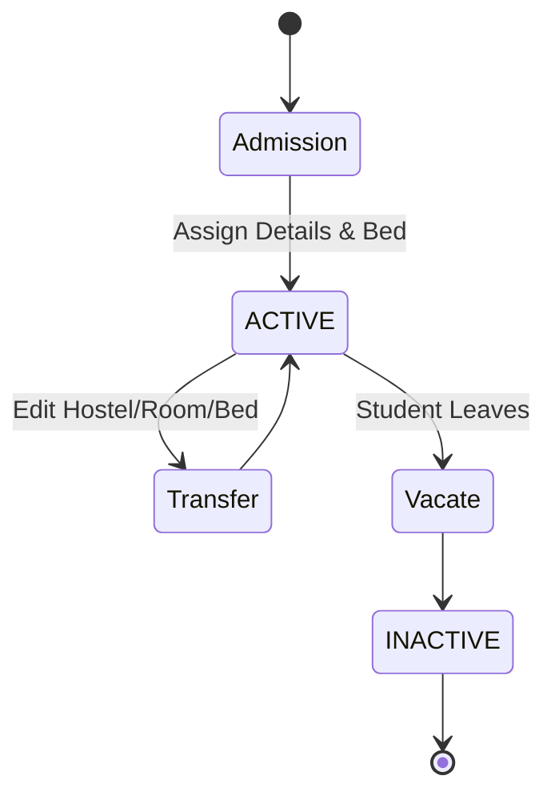
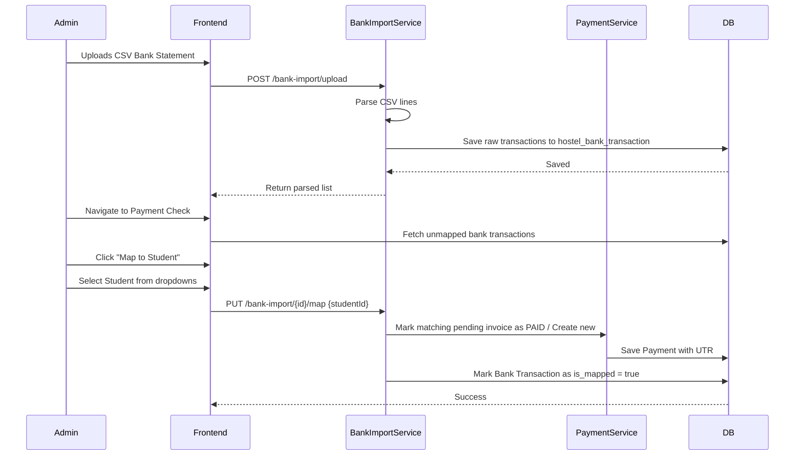
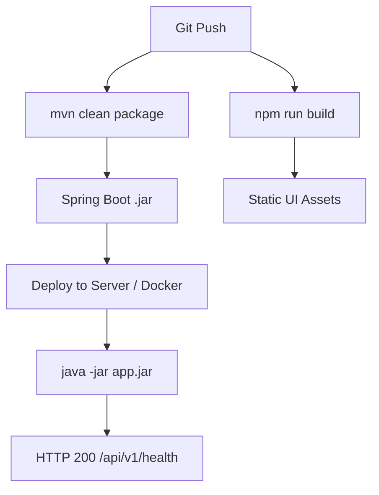

# Application Workflow Documentation

## 1. Overall System Flow

## 2. Authentication Flow

## 3. Dashboard Flow

- **KPI Calculation Flow:** When the dashboard mounts, the frontend requests `/api/v1/dashboard/stats`. The `DashboardServiceImpl` queries the DB.
  - **Vacant Beds:** Counts total active beds, subtracts beds with `status = 'OCCUPIED'`.
  - **Revenue:** Sums `amount` of all payments matching `status = 'PAID'`.
  - **Dynamic Filters:** If the frontend provides a `hostelId`, all JPA queries are restricted to entities belonging to that specific hostel.

## 4. Hostel Infrastructure Flow

## 5. Room & Bed Flow

1. **Room Creation:** Admin selects a Hostel context and adds a Room (Floor, Type, Capacity).
2. **Bed Generation:** Admin manually adds beds to the created room. Beds default to `AVAILABLE`.
3. **Assignment:** When a Student is assigned to a bed during admission, the bed's status automatically transitions to `OCCUPIED`.

## 6. Student Lifecycle Flow

## 7. Payment Collection Flow

1. **Generation:** At the start of the month, Admin clicks "Generate Invoices". The system creates a `PENDING` payment record for every `ACTIVE` student.
2. **Manual Entry:** If rent is paid via cash, Admin edits the pending payment, changes status to `PAID`, and leaves UTR blank.
3. **Digital Payment:** If rent is paid via UPI/Bank, Admin edits the pending payment, changes status to `PAID`, and enters the exact UTR Number.

## 8. Bank Statement Upload & Verification Flow (Payment Check)

## 9. Report Generation Flow

1. User navigates to `/reports` and selects a specific tab (e.g., Students).
2. Frontend fetches the complete unpaginated list of active students.
3. User clicks **Export CSV**.
4. Frontend executes a client-side CSV generation script (converting JSON array to CSV string) and triggers a browser download natively.

## 10. Search Flow

- **Frontend Filtering:** For screens like Payments and Students, the backend returns the entire list for the selected hostel. 
- **Dynamic Search:** The React component applies `.filter()` in real-time as the user types in the search box, instantly updating the data grids without additional API calls.
- **KPI Adjustment:** KPI metrics at the top of the screens are deliberately decoupled from the text-search filter, ensuring they always display true aggregate totals for the period.

## 11. Error Handling Flow

1. **Frontend Validation:** Zod schemas prevent invalid form submissions (e.g., negative rent, missing names).
2. **Backend Validation:** Spring Boot `@Valid` checks constraints.
3. **Business Rule Violation:** If a rule fails (e.g., UTR duplication), the Service throws an `IllegalArgumentException`.
4. **Global Handler:** `GlobalExceptionHandler.java` catches the exception and returns an HTTP 400 with `{"error": "UTR Number already exists"}`.
5. **UI Feedback:** Axios interceptor reads the error response and displays a red Toast notification in the bottom right corner.

## 12. Deployment Flow

## 13. Complete End-to-End Business Flow

1. **Onboarding:** Owner Login -> Create Hostel -> Create Room -> Add Beds.
2. **Admission:** Create Student Profile -> System Encrypts PII -> Assign to Bed -> Bed marked OCCUPIED.
3. **Billing:** Click 'Generate Invoices' on 1st of the month -> Pending payments created.
4. **Bank Reconciliation:** Export CSV from Corporate Bank -> Upload via System -> Process.
5. **Mapping:** Go to Payment Check -> See Unmapped UTRs -> Select Student -> Confirm.
6. **Closing:** Dashboard updates to reflect collected Revenue -> Print/Export Reports.
