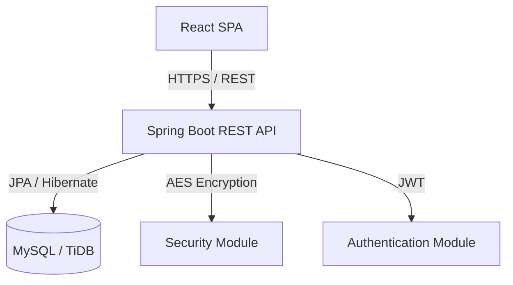
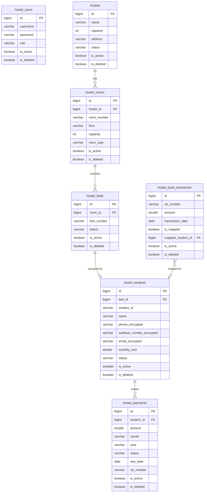

# Technical Requirement Document (TRD)

## 1. Technology Stack

- **Frontend:** React 18, TypeScript, Vite, Tailwind CSS, Shadcn UI, Framer Motion, TanStack Query (React Query), React Router, React Hook Form, Zod, Axios, Lucide React.
- **Backend:** Java 17+, Spring Boot 3.x, Spring Data JPA, Spring Security, Hibernate.
- **Database:** MySQL / TiDB (Relational).
- **Authentication:** Stateless JSON Web Tokens (JWT).
- **Deployment & Build:** Maven (Backend), npm/Vite (Frontend), standard containerization compatible.

## 2. Project Structure

The project is structured as a monolithic frontend and backend repository.

### Backend (`/backend`)
```
src/main/java/com/hostel/backend/
├── config/         # App configurations (Security, CORS, Mapper)
├── controller/     # REST API Controllers (Hostel, Room, Bed, Student, Payment, Auth)
├── dto/            # Data Transfer Objects (Request/Response models)
├── entity/         # JPA Entities mapping to DB tables
├── enums/          # Shared enumerations (BedStatus, HostelStatus)
├── exception/      # Global Exception Handler and custom exceptions
├── filter/         # JWT Authentication Filters
├── mapper/         # DTO to Entity mapping logic
├── repository/     # Spring Data JPA Repositories
├── security/       # JWT utilities, Encryption context, AES helpers
└── service/        # Business logic interfaces and implementations
```

### Frontend (`/frontend`)
```
src/
├── app/            # Global context (HostelContext) and App setup
├── assets/         # Static media files
├── components/     # Reusable UI (Shadcn components, layout components)
├── features/       # Feature modules (Dashboard, Hostels, Rooms, Beds, Students, Payments)
├── hooks/          # Custom React hooks (useToast)
├── lib/            # Utility functions (Tailwind merge)
├── services/       # Axios API client setup
└── types/          # TypeScript interfaces for frontend models
```

## 3. Architecture

### High-Level Architecture
The system follows a classic decoupled client-server architecture. The React SPA communicates with the Spring Boot backend exclusively via REST APIs.



- **Frontend Architecture:** Feature-based modular structure. Global state (selected hostel) is managed via React Context. Server state and caching are heavily managed by TanStack Query, eliminating the need for complex Redux setups.
- **Backend Architecture:** N-Tier architecture (Controller -> Service -> Repository).
- **Security:** Spring Security filters intercept requests, validate the JWT token from the `Authorization` header, and establish the SecurityContext.
- **File Upload:** Multipart file upload for CSV parsing, temporarily buffered in memory, parsed, and persisted to the DB.

## 4. Database Design



### Key Business Constraints
- **Soft Deletion:** Every core table includes `is_deleted` and `is_active` flags. No hard deletes are performed from the UI.
- **Encryption Fields:** `hostel_students` utilizes `_encrypted` columns for PII. The entity leverages `@PrePersist`, `@PreUpdate`, and `@PostLoad` JPA lifecycle hooks to automatically encrypt and decrypt data.

## 5. Backend Implementation

- **Controllers:** Expose REST endpoints (e.g., `/api/v1/students`). Responsible ONLY for HTTP request/response routing and validation.
- **Services:** Interfaces and `Impl` classes containing core business logic (e.g., validating UTR uniqueness, calculating dashboard stats).
- **Repositories:** Extends `JpaRepository`. Custom methods use strict naming conventions (e.g., `findByIsDeletedFalse()`) to exclude soft-deleted records.
- **DTOs:** Pure data structures used to prevent exposing internal JPA entities to the client.
- **Mappers:** Custom mapping classes translating between Entities and DTOs.
- **Exception Handling:** `@RestControllerAdvice` intercepts `ResourceNotFoundException`, `IllegalArgumentException`, etc., returning standardized JSON error payloads.

## 6. Frontend Implementation

- **Routing:** Handled by `react-router-dom`. Protected routes wrap the application, checking for a valid JWT token.
- **State Management (TanStack Query):** Handles all data fetching, caching, and invalidation. For example, editing a payment triggers `queryClient.invalidateQueries({ queryKey: ['payments'] })` to automatically refresh the grid.
- **Context:** `HostelContext` persists the globally selected `hostelId` to `localStorage` and provides it to all modules.
- **Theme & Design:** Built completely with Tailwind CSS utilizing a custom aesthetic design system with glassmorphism effects, gradients, and micro-animations. Shadcn provides the accessible component foundation.

## 7. API Documentation

*(Core Endpoints overview. All endpoints prefixed with `/api/v1` and require `Authorization: Bearer <token>`)*

- **Auth:**
  - `POST /auth/login`: Accepts `{username, password}`, returns JWT token.
- **Hostels:**
  - `GET /hostels`: Fetch all active hostels.
  - `POST /hostels`: Create a new hostel.
- **Rooms & Beds:**
  - `GET /rooms?hostelId={id}`: Fetch rooms for a hostel.
  - `GET /beds?roomId={id}`: Fetch beds for a room.
- **Students:**
  - `GET /students?hostelId={id}`: Fetch students.
  - `POST /students`: Create student (encrypts PII automatically).
  - `PUT /students/{id}`: Update student.
- **Payments:**
  - `GET /payments?hostelId={id}`: Fetch payments.
  - `POST /payments`: Record manual payment.
  - `PUT /payments/{id}`: Update payment (UTR uniqueness checked).
  - `POST /payments/generate-monthly?month=X&year=Y`: Batch generate invoices.
- **Bank Imports:**
  - `POST /bank-import/upload`: Accepts `multipart/form-data`.
  - `PUT /bank-import/{id}/map`: Maps a transaction to a student/payment.

## 8. Security

- **Authentication:** JWT tokens valid for 24 hours. Validated by `JwtAuthFilter` on every request.
- **Data Encryption:** Custom `EncryptionContext` utilizing AES (Advanced Encryption Standard). The secret key and salt are injected via environment variables.
- **CORS:** Configured to allow specific frontend origins to consume the API.
- **Validation:** Server-side validation using `jakarta.validation` (`@NotBlank`, `@Min`). Client-side validation using Zod schemas in React Hook Form.

## 9. Performance Optimization

- **Database Indexes:** Required on `utr_number`, `student_id`, `hostel_id`, and `is_deleted` flags to speed up aggregations.
- **JPA N+1 Mitigation:** Lazy loading (`FetchType.LAZY`) is used on relationships. Aggregation queries in `DashboardServiceImpl` fetch data optimally.
- **Frontend Caching:** TanStack query caches API responses and deduplicates simultaneous identical requests.

## 10. Deployment

- **Environment Variables:** Requires `DB_URL`, `DB_USERNAME`, `DB_PASSWORD`, `JWT_SECRET`, `APP_ENCRYPTION_SECRET`.
- **Database Migrations:** Configured currently via Hibernate `ddl-auto=update` (recommended to transition to Flyway/Liquibase for production).
- **Frontend Build:** `npm run build` compiles Vite assets into static HTML/JS/CSS, which can be served via Nginx or integrated directly into Spring Boot static resources.
